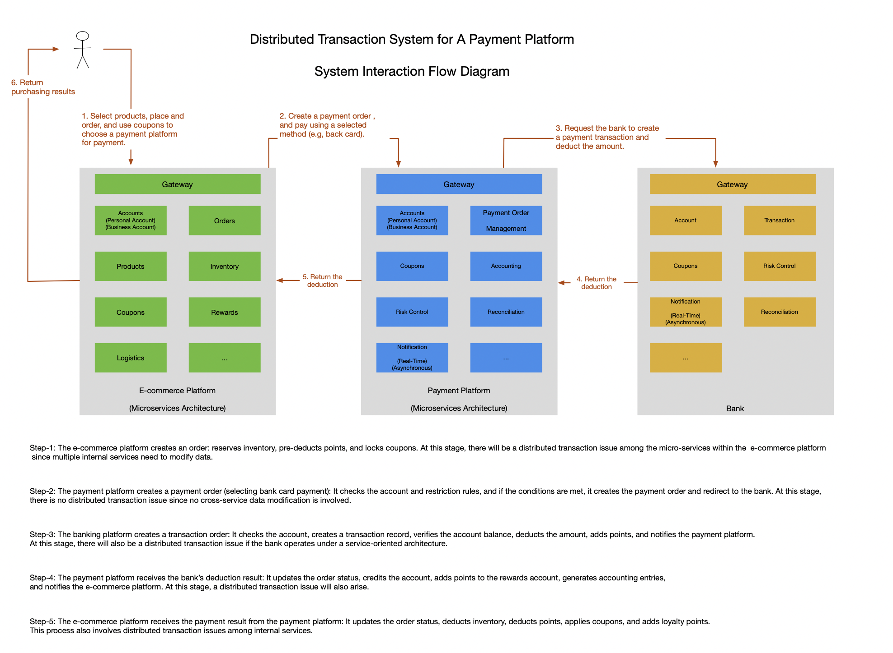

# Spring-MQ-Reliable-TX

## 🔗 Introduction 

- We all know that in **distributed systems**, transaction solutions typically fall into two main categories: **TCC (Try-Confirm-Cancel)** and **Reliable Messaging (Eventual Consistency)**.

- This repository focuses on **designing and implementing** these two solutions by integrating **Spring Boot 3.0 and RabbitMQ**, providing **enterprise-level distributed transaction solutions**. It demonstrates how to ensure **data consistency**, **decouple services**, and achieve **high reliability** in microservices architectures.

- Furthermore, this project is designed for **real-time payment systems**, showcasing practical adoption of **TCC and Reliable Messaging** to handle financial transactions with **precision and robustness**.

---

## 🌟System Architecture Diagram

---

## 📩 Use Scenarios 

This repository is designed for **enterprise-level distributed transactions** in critical financial domains, including: 
- 🛒 **E-commerce internal payment systems** - Ensuring reliable order payments, refunds, and transaction consistency.
- 🏦 **Financial and banking systems** - Hndling secure fund transfers, settlements, and transactions integrity across multiple services. 

---

## 🌟 Key Features
- **Reliable Messaging**: Ensures the consistency of messages across distributed services.
- **Spring Boot 3.0**: Simplifies microservice development and configuration.
- **RabbitMQ**: Uses RabbitMQ as the mssaging queue to handle communication between services.
- **Distributed Tarnsaction Solutions**
- **Reliable Mesage Final Conistency**: Ensures eventual consistency in distributed transactions.
- **TCC(Try-Confirm/Cancel)**: Implements a robust two-phase commit transaction model.
- **Maximum Effort Notification**: A flexible approach for guaranteening message delivery.

---

## 🚀 Technology Stack

- **Spring Boot 3.0**: Fast, flexible microservice framework for Java applications.
- **RabbitMQ**: Message broker that enables communication between services in a distributed architecture. It helps decouple services, ensuring reliable message delivery and eventual consistency in distributed transactions.
- **Spring MVC**: Framework for developing RESTful APIs.
- **MySQL**: Relational database management for storing transaction data.
- **Docker**: Containerization for easy deployment.
- **JDK 17**: Java Development Kit for building applications.

---

## 📚 Tutorial && References

This project is designed to help you implement **reliable messaging and distributed transaction** solutions in micoservices. 
It includes: 

- **Reliable Message Final Consistency**: Local and independent Message Service implementaitons. 
- **TCC Transactions Model**: Try-Confirm/Cancel approach. 
- **Maximum Effort Notification** Ensuring eventual consistency and retries. 

This sample project uses a **payment system** scenario and demostrates the following: 
- **Reliable Message Final Consitency**: A message is sent and confirmed with eventual consistency. 
- **TCC**: The implementation of **two-phase** commit in the distributed system. 
- **Maximum Effort Notification**: Handling retries and ensuring message delivery.

For a step-by-step guide on how these solutions work, check out the following tutorials: 
- [Message Sending Consistency]()
- [Reliable Message Final Consitency]()
- [TCC Distributed Transactions]()

---

## 📈 Use Cases

- **Distributed Payment Systems**: Ensure consistency in payments across multiple services; 
- **Order Management**: Handle distributed order creation, cancellation, and updates reliably. 
- **Event Driven Architecture**: Implement eventual consistency in microservices. 

---

## 📝 License
- [MIT LICENSE](./LICENSE)
