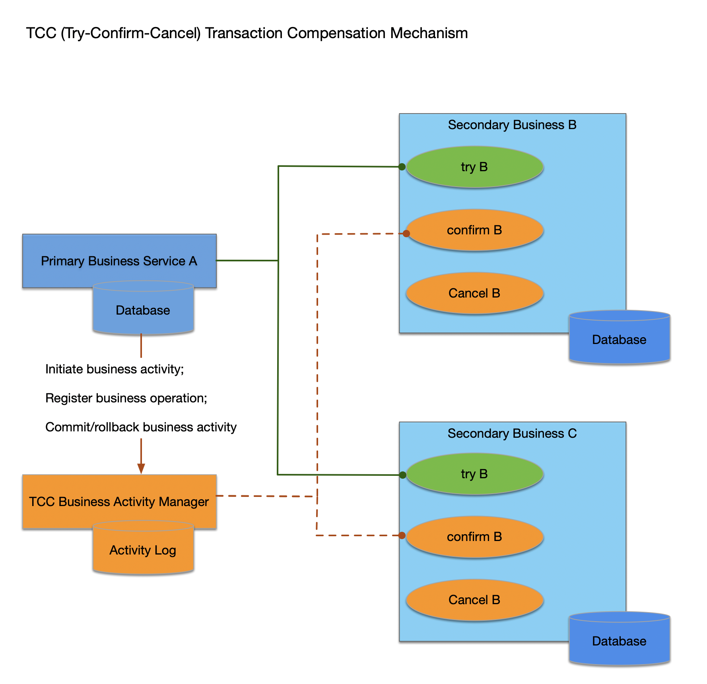

# Flexible Transaction Solution: TCC (Two-Phase, Compensation Model)

## Implementation 
- A complete business activity consists of a **main business service** and multiple **sub-business services**. 
- The **main business service** initiates and completes the entire business activity. 
- The **sub-business services** provide **TCC(Try-Confirm-Cancel)** opeartions. 
- The **business activity manager** ensures conssitency by recording operations in the business activity. 
- When the business activity **commits**, it calls the **Confirm** operation for all TCC-type actions. 
- When the business activity **roll back**, it calls the **Cancel** operation for all TCC-type actions. 

## Cost 
- Cost of **implementing TCC operations**.
- Execution cost of **Confirm** and **Cancel** operations after the business activity ends. 
- Logging cost for **business activity tracking**. 

## Applicable Scenarios
- **Strong isolation** and **strict conssitency** requirements. 
- Suitable for **short-duration** business transactions, such as **account processing and payment transactions**.

## Service Modes Used 
- TCC operations, compensation operations, idempotent, and query operations. 

## Solution Characteristics 
- Independenty of specific service frameworks (applicable in RPC architectures).
- Operates at the business service layer, rather than the resource layer. 
- Allows flexible selection of business resource locking granularity.
- In TCC, each service resource operation is a local transaction, meaning data lock time is short and scalability is good (designed for independent SOA service deployment).

## Industry Application Example 
- Alipay XTS (Ant Financial Cloud's Distributed Transaction Service DTS). 